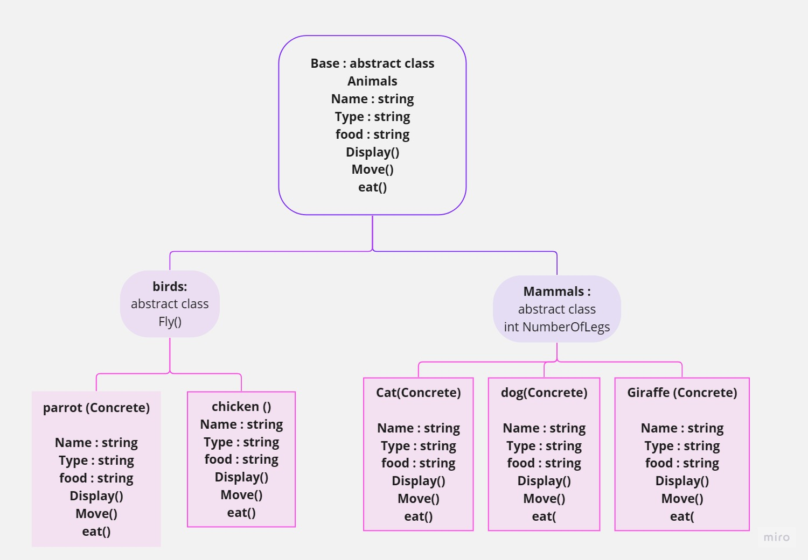

# Lab06-zoo
## Introduction
In this project,we plan and build out what animals live in the zoo. we have built a virtual zoo using object-oriented programming 
(OOP) principles  such as inheritance, polymorphism,
encapsulation, and abstraction .
## UML Diagram

## Technical Documentation
### Inheritance
 Inheritance is a fundamental concept in C# programming that allows classes to derive properties and behaviors from other classes. By creating a hierarchy of classes, derived classes can inherit and extend the functionality of their base classes. Inheritance promotes code reuse, simplifies maintenance, and enables polymorphism, which allows objects of different derived classes to be treated as instances of their common base class.

### Abstract
Link 2: Abstract and sealed classes play important roles in class design in C#. Abstract classes cannot be instantiated and serve as blueprints for derived classes, providing common functionality and defining abstract members that must be implemented by derived classes. Sealed classes, on the other hand, prevent inheritance and are useful for creating classes that should not be extended. Abstract and sealed class members help enforce design contracts and encapsulate specific behaviors within classes.

### Polymorphism 
 Polymorphism is a powerful concept in object-oriented programming that allows objects to exhibit different behaviors depending on their types or the context in which they are used. In C#, polymorphism is achieved through method overriding and interfaces. Method overriding enables derived classes to provide their own implementation of base class methods, while interfaces define a contract that classes can implement to achieve polymorphic behavior. Polymorphism enhances code flexibility, extensibility, and modularity.

### (OOP)
Object-oriented programming (OOP) is a programming paradigm that organizes code around objects, which represent real-world entities or concepts. C# is an object-oriented language that fully supports OOP principles. OOP encourages modular design, encapsulation of data and behavior within classes, and the use of inheritance and polymorphism to achieve code reuse and extensibility. By modeling software systems based on objects and their interactions, OOP enables developers to write more maintainable, scalable, and reusable code.
## Examples in the Project
Inheritance: The dog class inherits from the Mammles class, which in turn inherits from the Animals class, demonstrating multiple layers of inheritance. The dog class extends the behavior of its parent classes by overriding methods like Eat(),and  Move().

Polymorphism: The code demonstrates polymorphism through method overriding and virtual

